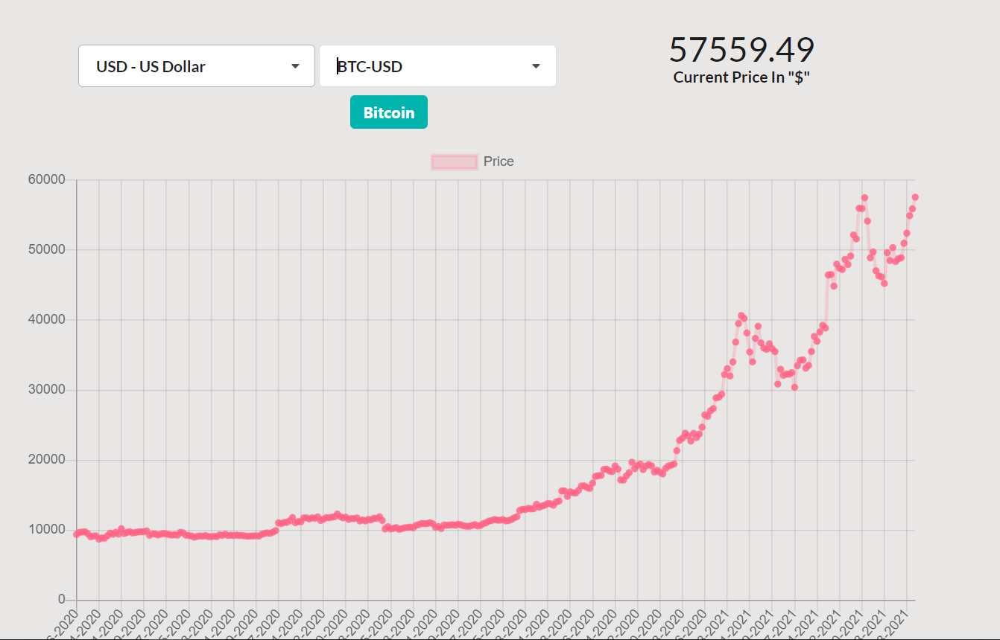

# Crypto currency tracker
This is a crypto currency tracker , created in [ReactJS](https://reactjs.org/) and use [CoinBase API](https://docs.pro.coinbase.com/#api) to fetch the latest prices for selected crypto-currencies.

The historical data is plotted on a graph using [React Charts](https://www.npmjs.com/package/react-chartjs-2).

 The initial reference was taken from the [Codeburst.io-Build a cryptocurrency dashboard with React](https://codeburst.io/build-a-cryptocurrency-dashboard-with-react-d9e476de91ef)

 CSS Framework used  : [React Semantic UI](https://react.semantic-ui.com/)

## Demo Screenshot

## Steps to run

 #### Install all dependencies
    $ yarn  

 #### Run the application
    $ yarn start